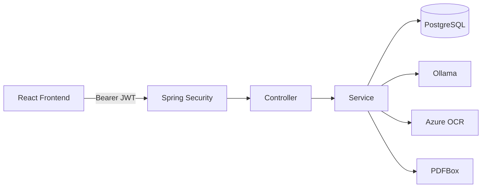

# WorkNote Backend

> 日々の業務記録を、AIで整理し、振り返り・面接準備・目標管理につなげる WorkNote のバックエンドです。

[한국어 README](./README-ko.md)

## 概要

WorkNote Backend は Spring Boot を中心に構築した REST API サーバーです。
単純な業務日誌 CRUD だけではなく、認証・権限管理、AI 分析、Azure OCR、カレンダー、目標管理、ダッシュボード、AI レポート/PDF 生成までを一つのサービスとして統合しています。

設計上は、クライアントから渡されるユーザー ID をそのまま信用せず、JWT の認証情報を基準にユーザーを特定することを基本方針としています。

## 主な機能

| 分類 | 内容 |
| --- | --- |
| 認証 | 会員登録、ログイン、JWT Stateless 認証、BCrypt パスワードハッシュ化 |
| 入力検証 | ログイン ID・パスワード・ニックネームのサーバー側 Validation |
| 業務記録 | 登録・一覧・詳細・編集・削除、業務日付の変更 |
| AI 分析 | 業務内容の要約、技術タグ、難易度、想定面接質問の生成 |
| OCR | Azure AI Document Intelligence による画像文字認識と業務記録下書き生成 |
| カレンダー | 月単位の業務記録・目標表示、Drag & Drop 用の日付更新 |
| 目標管理 | 開始日・終了日、状態、進捗率、期間変更、進捗更新 |
| ダッシュボード | ログインユーザーの業務記録・統計・最近の記録を集約 |
| AI レポート | 累積業務記録からプロジェクトレポートを生成 |
| PDF | 韓国語・日本語フォントに対応した PDF レポート出力 |
| 利用量制御 | ユーザー単位・日単位で AI / Azure OCR の呼び出し回数を制限 |

## 技術スタック

- Java 21
- Spring Boot 3.5.4
- Spring Web / WebFlux
- Spring Security
- JWT (`jjwt`)
- Spring Data JPA / Hibernate
- PostgreSQL
- Lombok
- springdoc OpenAPI / Swagger UI
- Apache PDFBox
- Azure AI Document Intelligence
- Ollama
- Gradle

## アーキテクチャ



## 認証・セキュリティ

### JWT 認証

- Stateless 認証
- `Authorization: Bearer <token>` 形式
- JWT の署名・有効期限を検証
- 運用環境では `JWT_SECRET` を必須環境変数として設定
- ハードコードされた運用用 Secret の fallback は使用しない

### パスワード

- BCrypt でハッシュ化して保存
- 平文パスワードは DB に保存しない

### 所有権チェック

業務記録・目標・ダッシュボードなどのユーザー固有データは、JWT で認証されたユーザーを基準にアクセスを制御します。

特にダッシュボードは、クライアントから渡されたユーザー ID をそのまま信用する設計ではなく、認証コンテキストからログインユーザーを取得する方式を採用しています。

## 入力 Validation

フロントエンドの Validation はユーザー体験向上のために使用し、最終的な検証は必ずバックエンドでも実施します。

| 項目 | ルール |
| --- | --- |
| ログイン ID | 4〜20文字、半角英字・数字・`_` のみ |
| 新規パスワード | 8〜64文字 |
| ログイン時パスワード | 最大64文字 |
| ニックネーム | 2〜12文字、文字・数字・空白・`_` |

## 業務記録

業務記録では「作成日時」と「実際の業務日」を分離しています。

```text
createdAt : 最初に作成した日時
workDate  : カレンダー上で扱う業務日
```

そのため、カレンダー上で業務記録を別の日へ移動しても、元の作成日時は保持されます。

主な処理:

- 登録
- 一覧取得
- 詳細取得
- 編集
- 削除
- `workDate` のみ変更
- AI 分析結果の保存

## カレンダー

月単位で以下をまとめて取得します。

- 業務記録
- 期間内の目標
- 目標の進捗率
- 完了状態
- 期限超過状態

フロントエンドでは次の操作に利用します。

- 業務記録の Drag & Drop
- 目標期間の移動
- 目標開始日 / 終了日の Resize
- 日付ダブルクリックによる業務記録のクイック作成
- 完了目標のチェック表示・取り消し線表示

## 目標管理

目標は単一の締切日ではなく、期間を持つ予定として管理します。

```text
startDate  : 開始日
targetDate : 終了日 / 締切日
status     : PLANNED / IN_PROGRESS / COMPLETED
progress   : 0〜100
```

進捗率は次のように状態と連動します。

- 0% → `PLANNED`
- 1〜99% → `IN_PROGRESS`
- 100% → `COMPLETED`

期限を過ぎても完了していない目標は overdue として扱います。

## AI 分析

業務記録から、主に以下を生成します。

- 要約
- 技術タグ
- 難易度
- 想定面接質問

AI サービスは Ollama を利用し、接続先・モデル・タイムアウトは環境変数で変更できます。

## Azure OCR

画像から文字を抽出し、抽出結果を AI に渡して業務記録の下書きを生成します。

主なサーバー側チェック:

- JPG / JPEG / PNG
- 最大ファイルサイズ
- MIME Type だけでなく実画像として解析可能か確認
- 画像サイズ制限
- OCR 認識文字数制限

画像そのものや OCR 元テキストは WorkNote の業務記録としてそのまま保存せず、下書き生成に利用します。

## AI / OCR 日次利用制限

外部 AI・OCR 機能の過剰利用を防ぐため、ユーザーごとの日次使用回数を DB に記録します。

デフォルト値:

```text
AI        : 20回 / 日 / ユーザー
Azure OCR : 5回 / 日 / ユーザー
```

値は環境変数で変更できます。

画像から業務記録下書きを作成する処理では、OCR と AI の両方を使用します。

## ダッシュボード

ダッシュボードではログインユーザーの情報だけを集約します。

- 業務記録数
- 技術タグ統計
- 難易度統計
- 最近の業務記録

認証済みユーザーをサーバー側で判定するため、フロントエンドから任意のユーザー ID を渡して他ユーザーの情報を参照する設計にはしていません。

## AI レポート / PDF

累積した業務記録を基に AI レポートを生成し、PDF として出力できます。

PDF フォントは韓国語・日本語で分離しています。

```text
韓国語 : NanumGothic.ttf
日本語 : ipaexg.ttf
```

フォントファイルはライセンス・配布条件の都合上、リポジトリには含めず、実行環境で用意する構成を推奨しています。

## 主要な環境変数

実際の Secret や API Key は Git にコミットせず、ローカル環境またはデプロイ先の Environment Variables に設定してください。

```text
JWT_SECRET
DB_URL
DB_USERNAME
DB_PASSWORD
CORS_ALLOWED_ORIGINS
OLLAMA_BASE_URL
OLLAMA_MODEL
OLLAMA_API_KEY
OCR_AZURE_ENDPOINT
OCR_AZURE_API_KEY
AI_DAILY_LIMIT
AZURE_OCR_DAILY_LIMIT
REPORT_PDF_KOREAN_FONT_PATH
REPORT_PDF_JAPANESE_FONT_PATH
SWAGGER_ENABLED
```

## ローカル実行

### 1. PostgreSQL を起動

プロジェクトの設定に合わせて PostgreSQL を起動します。

### 2. JWT Secret を設定

PowerShell の例:

```powershell
$env:JWT_SECRET="your-local-development-secret-key"
```

### 3. Spring Boot を起動

```powershell
.\gradlew.bat bootRun --args="--spring.profiles.active=local"
```

macOS / Linux:

```bash
./gradlew bootRun --args='--spring.profiles.active=local'
```

## ビルド

Windows:

```powershell
.\gradlew.bat clean build
```

macOS / Linux:

```bash
./gradlew clean build
```

## デプロイ時の注意

運用環境では、少なくとも以下を環境変数として明示的に設定してください。

- `JWT_SECRET`
- DB 接続情報
- CORS 許可 Origin
- Azure OCR 認証情報（OCR を使用する場合）
- Ollama / AI 接続情報

Secret・Password・API Key は README、`.env.example`、ソースコードに実値を書かない方針です。

---

WorkNote は「機能を追加すること」だけではなく、認証境界、外部 AI 利用コスト、データ所有権、業務日と作成日時の分離など、実際の Web サービス運用を想定した設計改善を重ねながら開発しています。
